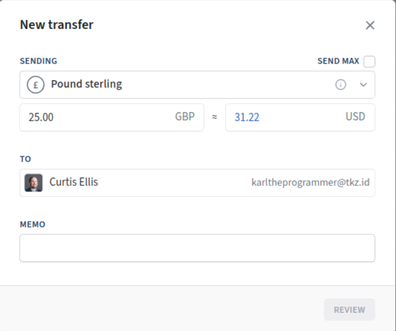

# Transaction Negotiation

Transaction negotiation is a process of sending a partial transaction back and forth between two parties, an initiator and a counterparty, to negotiate a final version of the transaction. The initiator creates a partial transaction that contains enough information for the counterparty to know what is being requested. Then the counterparty can add their information to the transaction and send it back. There can be several rounds of communication before finalizing and signing the transaction.

The data included in this structure include the partial transaction and other data to supplement it.
* A thread ID is included to link a transaction to previous versions.
* Ancestors are included so both parties can calculate fees, verify signatures, and see any relevant historical information.
* Fee information can be included so both parties can adjust to the same tx fee rate.
* An expiry is included so both parties know when the other will no longer want to continue the negoatiation.
* A timestamp is included so both parties know when each update was made.
* Reply to information is included so that each party knows where to send responses.

Previous methods of interacting with another wallet have lacked the ability to do anything more than simple bitcoin payments and are not really peer to peer. Including a full transaction structure with ancestors allows much more dynamic and complex interactions like negotiating transfer and exchange of [Tokenized](https://tokenized.com/) tokens.

Since this method establishes "reply to" information, rather than just returning results via REST API, followup information can be provided to the other party when it becomes available, like merkle proofs and token settlements. This also allows requests to be responded to directly by users rather than needing the service host to automatically respond to all requests.

The specifics of how to structure transactions is explained [here](https://github.com/tokenized/channels/blob/master/negotiation/transactions.md).

## Terms

* Initiator is the party that initiates the negotiation.
* Counterparty is the party that is not the initiator.
* BRFC (Bitcoin Request For Comments) is used to specify bsvalias features and endpoints. The BRFCID is used to uniquely identify features.

## Transaction Negotiation BRFC

| Field    | Value                    |
|----------|--------------------------|
| Title    | Transaction Negotiation  |
| Author   | Curtis Ellis (Tokenized) |
| Version  | 1                        |
| BRFCID   | bc2add1aae8e             |

Transaction Negotiation is a dynamic endpoint that can be used to negotiate transfers of any kind.

Features:

# Conversations

By tagging messages with a unique ID several messages can be exchanged and linked to the same conversation "thread".

# Delayed Responses

By including a handle and/or peer channels the service doesn't have to provide the response immediately. The service can provide the message to the user and let the user respond.

# Callbacks

[Tokenized (T2) settlements](https://tokenized.com/#/protocol/docs/protocol/actions/section/settlement), merkle proofs, and other data needed after a transaction is complete can be provided via the included handle and peer channels.

### HTTP Response Codes

* 202 (Accepted) The data was accepted. If a response is appropriate then when it is available it will be posted to the reply handle or peer channels provided.
* 404 (Not Found) The specified handle is not found on this host.
* 400 (Bad Request) The request is invalid. The body will contain a text description of the issue.
* 406 (Not Acceptable) The request contained protocols or scenarios not supported by this service implementation. The body will contain a text description of the issue. For example if a request contains peer channels to reply to and the service doesn't have that implemented. Or if the request is asking for payment to be sent and the services doesn't support that.

### Data Structure

The body of a Transaction Negotiation HTTP request uses the following JSON structure.

```
{
	"thread_id": "Unique Conversation Identifier",
	"fees":[
		{
			// The minimum number of satoshis per the number of bytes for the specified fee type.
			"feeType": "<standard or data, same as merchant api>",
			"satoshis": 50,
			"bytes": 1000
		}
	],
	"expanded_tx": {
		"tx": "hex encoded raw bitcoin transaction",
		"ancestors": [
			{
				"tx": "hex encoded raw bitcoin transaction",
				"merkle_proofs": [
					{standard JSON merkle proof}
				],
				"miner_responses": [
					{standard JSON envelope containing relevant merchant-api responses}
				]
			}
		],
		"spent_outputs": [
			{
				"value": 1,
				"locking_script": "hex encoded locking script",
			}
		]
	},
	"expiry": <nano-seconds since unix epoch>,
	"timestamp": <nano-seconds since unix epoch>,
	"reply_to": {
		"handle": "Callback Paymail Handle",
		"peer_channel": "https://<host>/api/v1/channel/<channel_id>?token=<write_token>"
	}
}
```

## Negotiation Capabilities BRFC

| Field    | Value                    |
|----------|--------------------------|
| Title    | Negotiation Capabilities |
| Author   | Curtis Ellis (Tokenized) |
| Version  | 1                        |
| BRFCID   | f636191c8fe6             |

Negotiation Capabilities is an endpoint that supplies capabilities specific to an alias for negotiating transactions.

### HTTP Response Codes

* 200 (Okay) Request is valid and handle is found
* 404 (Not Found) The specified handle is not found on this host.

### Protocols

The protocols field declares which protocols are supported by this alias in negotiation messages. When using bsvalias and JSON as the communication protocol this will mainly be protocol identifiers for token or other protocols used within the transaction. When using peer channels and BSOR this also specifies which types of envelope encoding protocols can be used to wrap around the transaction.

### Options

The options field declares supported negotiation features. The values define which types of negotiation requests are acceptable and how some types of negotiation requests will be responded to.

`send_disabled` is true when simple send requests are not supported. They are assumed to be supported by default.

`auto_send_response` is true when a request to send will be responded to immediately without waiting for user approval. This provides receiving locking scripts from the recipient.

`receive` means that simple receive requests are supported. Privacy can be retained if the initiator request has zeroized input hashes and indexes.

`three_step_exchange` is true when the implementation supports 3 step exchanges.

`four_step_exchange` is true when the implementation supports 4 step exchanges which seem like 2 step exchanges from the UX perspective if the second step is automated by an agent. If the initiator gets an immediate unsigned response from the counterparty then they can sign in the same user action leaving only one step left for the counterparty to sign. Privacy can be retained if the counterparty response has zeroized input hashes and indexes with locking information and the initiator just signs with "anyone can pay" sig hash flag so that the counterparty can update their inputs before signing.

`auto_exchange_response` is true when a request to exchange will be responded to immediately without waiting for user approval. This provides receiving locking scripts and sending input information (that may be masked) from the recipient.


```
{
	"protocols": ["TKN", "test.TKN", "S", "UL", other protocol ids"],
	"options": {
		"send_disabled": false,
		"auto_send_response": true,
		"receive": true,
		"three_step_exchange": false,
		"four_step_exchange": true,
		"auto_exchange_response": true
	}
}
```

## Merkle Proofs BRFC

| Field    | Value                    |
|----------|--------------------------|
| Title    | Merkle Proofs  |
| Author   | Curtis Ellis (Tokenized) |
| Version  | 1                        |
| BRFCID   | b38a1b09c3ce             |

Merkle Proofs is an endpoint that allows posting of merkle proofs to a handle following an exchange of a transaction that one of the parties broadcast to the Bitcoin miners. The party that broadcast the transaction is expected to deliver all relevant merkle proofs to the other party. The transaction id (double SHA256) contained in the merkle proofs is considered enough identifying information for the service to know what to do with it.

### HTTP Response Codes

* 202 (Accepted) The merkle proofs were received successfully.
* 400 (Bad Request) One of the merkle proofs were invalid. The body will contain a text description of the issue.

### Data Structure

The body of a Transaction Negotiation HTTP request uses the following JSON structure.

```
[
	{standard JSON merkle proof}
]
```

## Workflows

### Simple Unsolicited Tokenized Payment

Sender wants to send some Tokenized tokens to a recipient.



1. The sender posts a negotiation transaction to recipient handle that includes a thread ID, the sender's handle, and a transaction containing a [Tokenized (T1) Transfer](https://tokenized.com/#/protocol/docs/protocol/actions/section/transfer) action with senders and possibly change receivers. The sum of the quantity of the senders minus the sum of the quantity of the receivers is the quantity that is to be paid to the recipient. The transaction must contain at a minimum the outputs being spent by the inputs of the transaction and possibly full ancestor transactions for the inputs.
2. The recipient service verifies all protocols in the transaction and the token are supported and responds with HTTP 202 Accepted.
3. The recipient client sees the request and approves it by adding transfer receivers and responds to the request via the reply_handle or reply_peer_channels with the updated negotiation transaction containing the same thread ID and the recipient's handle for any further negotiations.
3. The sender sees the response, verifies that the negotiation transaction has all necessary receivers (Tokenized Transfers must have matching sender and receiver quantity sums), and updates the contract and tx fees, adds any inputs for transaction funding, signs all inputs, and posts the completed negotiation transaction back to recipient's handle with the same thread ID and the same reply_handle or reply_peer_channels values.
4. The recipient service verifies the transfer tx is not malformed and meets their requirements for fees and anything else and broadcasts to the miners. If the broadcast fails the recipient service responds to the HTTP request with a 400 (Bad Request) and a text body containing a description of the issue as received from the miners. If the broadcast succeeds then the recipient service responds to the HTTP request with a 200 (OK).
5. The recipient later receives the transaction containing the Tokenized (T2) Settlement action from the smart contract agent and posts it in a negotiation transaction to the sender's reply_handle or reply_peer_channels.
6. The recipient later receives merkle proofs for the transactions containing the Tokenized (T1) Transfer and Tokenized (T2) Settlement actions and posts to sender's merkle proofs endpoint for the reply_handle or reply_peer_channels.

## Warnings

There is the risk that during exchange and modification of the negotiation transaction that the other party could try to get you to sign something that you don't want to.

### Examples

* If the other party knows your UTXOs, they could try to add your UTXOs as inputs and if you don't check you could sign it simply because your wallet recognizes it as yours and it is in the transaction. Depending on how your wallet does signing.
* The other party could add some higher level protocol data that your wallet doesn't recognize to the transaction like agreeing to a legal contract or signing for a token protocol not supported by your software.

### Safety Guidelines

* Keep track of which inputs you add to the tx and make sure your wallet only signs those.
* If there are any unrecognized output locking script formats, especially `OP_FALSE OP_RETURN`, then abort the negotiation with a 406 (Not Acceptable).